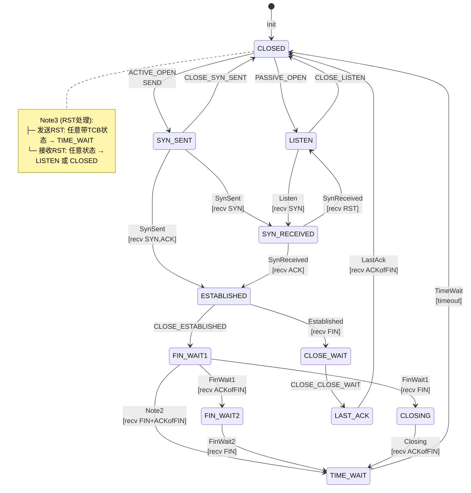

```mermaid
stateDiagram-v2
    [*] --> CLOSED: Init
    
    %% 连接建立阶段
    CLOSED --> LISTEN: PASSIVE_OPEN
    CLOSED --> SYN_SENT: ACTIVE_OPEN<br/>SEND
    
    SYN_SENT --> CLOSED: CLOSE_SYN_SENT
    SYN_SENT --> SYN_RECEIVED: SynSent<br/>[recv SYN]
    SYN_SENT --> ESTABLISHED: SynSent<br/>[recv SYN,ACK]
    
    LISTEN --> CLOSED: CLOSE_LISTEN
    LISTEN --> SYN_RECEIVED: Listen<br/>[recv SYN]
    
    SYN_RECEIVED --> LISTEN: SynReceived<br/>[recv RST]
    SYN_RECEIVED --> ESTABLISHED: SynReceived<br/>[recv ACK]
    
    %% 数据传输阶段
    ESTABLISHED --> FIN_WAIT1: CLOSE_ESTABLISHED
    ESTABLISHED --> CLOSE_WAIT: Established<br/>[recv FIN]
    
    %% 连接终止阶段（四次挥手）
    FIN_WAIT1 --> CLOSING: FinWait1<br/>[recv FIN]
    FIN_WAIT1 --> FIN_WAIT2: FinWait1<br/>[recv ACKofFIN]
    FIN_WAIT1 --> TIME_WAIT: Note2<br/>[recv FIN+ACKofFIN]
    
    FIN_WAIT2 --> TIME_WAIT: FinWait2<br/>[recv FIN]
    
    CLOSING --> TIME_WAIT: Closing<br/>[recv ACKofFIN]
    
    CLOSE_WAIT --> LAST_ACK: CLOSE_CLOSE_WAIT
    
    LAST_ACK --> CLOSED: LastAck<br/>[recv ACKofFIN]
    
    TIME_WAIT --> CLOSED: TimeWait<br/>[timeout]
    
    %% 重置处理（Note3 - 从任意状态）
    note right of CLOSED
        Note3 (RST处理):
        ├─ 发送RST: 任意带TCB状态 → TIME_WAIT
        └─ 接收RST: 任意状态 → LISTEN 或 CLOSED
    end note
```
